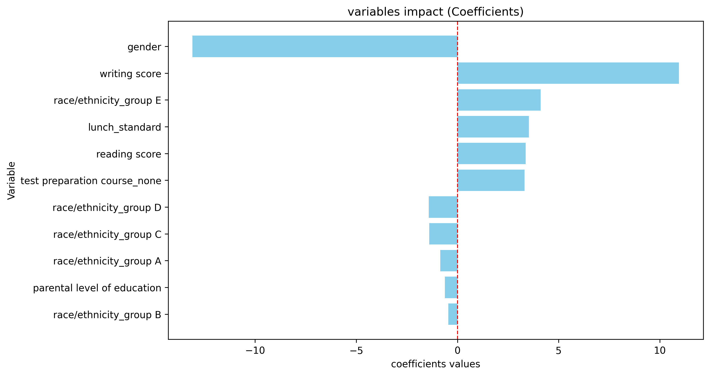

# math score, studens performance prediction

## Description
with the knowledge about EDA and basic machine learning train a model to predict
the students math scores

## Dataset
- By: [kaggle - Students Performance in Exams](https://www.kaggle.com/datasets/spscientist/students-performance-in-exams)
- principal variables: "gender","race/ethnicity","parental level of education","lunch","test preparation course","math score","reading score","writing score"

## realizing steps in this project

1. cleaning data
    - apply get_dummies pandas method to change categorical variables.
    - change gender feature into numerical type (female: 1, male: 0).
    - Assign integer values to the educational level of parents from 1 to 5 to create a hierarchy.

2. baseline model
    - model: linearRegression
    - divide the data into test, training to train the model, and validate predictions.
    - try the model precission with the  sklearn R2_score metric

3. scaled model
    - model: linearRegression. 
        - in this case, we have a data with boolean features and the integer features parental level of education,math score,reading score,writing score. it is recommended to scale this features for the coefficients interpretation, i used standarscaler to scale this features
    - define X and y, split data in train and split, after, scale just the numerical features in X_train data
    - we just wanted to scale the numerical features in X, because the others are boolean and it is not good to scale boolean features
    - train the model
    - create a dataframe with coefficients and their variables
    - show the dataframe
    - add a impact column that is the absolute value of the coeficients to see the variable impact on the prediction
    - graph the coefficients
        - coefficients (B_i) interpretation:
            - coefficient on the right:
                - possitive impact. 
            - coefficient on the left:
                - negative impact. 
            - interpretation:
                - if the coefficient value is bigger the variable impact on the prediction will be greater, no matter the sign

    
    

## conclusions
1. baseline_model
- the model has an R2_score of 0.88, thats is a higher score.

2. scaled_model
- The model lowers its r2_score, this is normal, the little changes about 0.05 in r2_score after the scaled is normal, don't worry about that
- 

3. coefficients

- here we see two variables that have a major impact, gender and writing score, we can say that when the student is a male (remember that female: 1, male: 0) the prediction tends to increases, this is the prediction model, if we give them more variables like be late or not, or old grade point averages the coefficient can change a lot
- and the writing score is positive, when the writing score increses, the prediction increses, so when a student has a great writing score, the math score will be positive 
- We see that when numerical variables are not scaled, it is not possible to see their importance at the time of prediction. When we scale them, we can see that the writing score characteristic has a significant impact on the result, which is not visible without scaling. However, the gender variable remains the same, as it has the same value in both databases (int female:1, male: 0).

## Next step
try to improve the model looking for others algorythms or modified variables and try other metrics to evaluate the model.
try to see the diferences between unscaled and scaled models metrics
